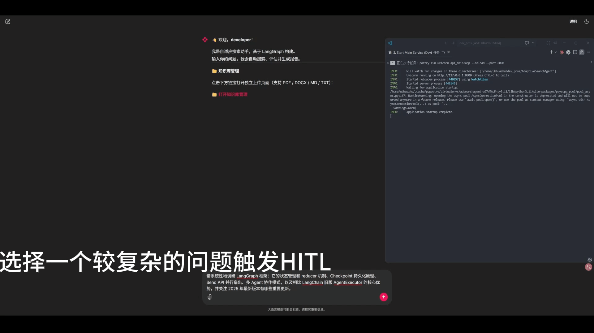
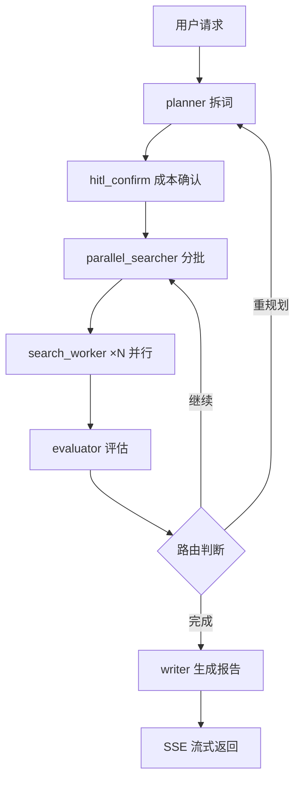

# AdaptiveSearchAgent

基于 LangGraph 的自适应搜索 Agent，实现「规划 → 并行搜索 → 评估 → 重试 → 生成报告」闭环，支持本地知识库（RAG）与在线搜索（Tavily）双路并行。

---

AdaptiveSearchAgent搜索对话过程GIF


---

## 解决什么问题

当你提一个需要调研的问题（比如"对比几款 GPU 的功耗和性能"）时，系统自动拆解成多个搜索关键词，并行地从本地知识库和互联网同时搜索，然后评估找到的信息够不够——不够就自动补搜，够了就生成一份带来源和成本统计的 Markdown 调研报告。全程无需人工干预，只在可能产生高额搜索费用时主动向你确认。

---

## 核心亮点

### 1. Send 扇出 + 多 Wave 自适应循环
关键词级并行搜索：一个节点分批关键词，扇出多个 worker 并行检索，四分支路由实现「搜到满意为止、但绝不超限」。**最多 5 个关键词并行、3 轮迭代上限**。
代码：`src/agents/parallel_searcher.py:75`、`src/graph_factory.py:33`

### 2. HITL 高成本前置确认
首轮搜索前估算成本，达到阈值时用 `interrupt()` 暂停图执行，用户确认后才继续，取消则零费用。**阈值 5 个关键词、单价 0.02 元/词**。（后续可按模型厂商实际费率动态估算）
代码：`src/agents/hitl_confirm.py:38`、`src/graph_factory.py:87`

### 3. RRF + FlagReranker 多级检索（调用子服务）
主服务通过 HTTP 调用 RAG 子服务的混合检索——向量 + BM25 用 RRF 融合（`k=60`）、候选池放大 3 倍、FlagReranker 交叉编码器精排。细节见 [rag-ingest-gateway](https://github.com/suimochuansheng/rag-ingest-gateway)。
主服务调用（消费方）：`src/tools/rag.py:13`


### 4. 双模型备援 + 四层 JSON 容错
LLM 主模型 Ollama 失败后指数退避重试、自动切换 DeepSeek；LLM 输出 JSON 用四层解析兜底（直接解析 → 正则提取 → 贪婪匹配 → DeepSeek 修复）。**重试 2 次、并发限流 2**。
代码：`src/utils/llm_utils.py:105`、`src/utils/json_parser.py:125`

### 5. Redis 分布式锁 + 双连接池
会话级 Redis 锁防止同一会话并发重复执行（含僵尸锁自愈）；数据库连接池拆成 Checkpointer 专用池 + 业务池隔离。**锁 TTL 600 秒、Saver 池 max10 / 业务池 max5**。
代码：`api_main.py:238`、`src/checkpointer.py:29`

---

## 量化结果

| 指标 | 值 |
|---|---|
| 单次请求 LLM 调用上限 | 5 次（1 planner + 3 evaluator + 1 writer，max_iterations=3） |
| 搜索并发 | 5 个关键词 × 2 路检索 = 10 并发 I/O |
| 置信度阈值 | 0.8（达到即停止搜索） |
| Redis 锁 TTL | 600 秒 |
| 代码规模 | 主服务约 3.5k 行（Python） |
| 测试覆盖 | 14 个测试文件 |

---

## 架构图



> search_worker 通过 HTTP 调用 RAG 子服务（rag-ingest-gateway）做本地知识库检索。

---

## 技术栈

- **核心**：Python 3.11 / LangGraph / FastAPI / PostgreSQL（pgvector + Checkpointer）/ Redis / Ollama
- **工程**：SSE 流式 / Docker Compose / pytest / Langfuse 追踪 / Chainlit 前端 / DeepSeek 备援 / Tavily 在线搜索

---

## 快速开始

**前置依赖**：

- Docker（用于 PostgreSQL + Redis）
- Poetry（Python 依赖管理）
- Ollama + 已下载模型 `qwen2.5:7b`
- RAG 子服务已独立部署（见 [rag-ingest-gateway](https://github.com/suimochuansheng/rag-ingest-gateway)），与主服务放在同一父目录

```bash
# 0. 启动依赖服务（PostgreSQL + Redis）
docker compose up -d db_dev db_test redis

# 1. 安装 Python 依赖
poetry install

# 2. 启动主服务后端（端口 8000）
poetry run uvicorn api_main:app --reload --port 8000

# 3. 启动对话前端（可选，端口 8001）
poetry run chainlit run frontend/app.py --port 8001
```

> 健康检查：`GET http://localhost:8000/health` 应返回 `{"status":"ok"}`

---

## 项目结构

```bash
AdaptiveSearchAgent/
├── api_main.py              # FastAPI SSE 流式入口（含分布式锁、任务状态机）
├── config.py                # Pydantic Settings 全局配置
├── src/
│   ├── state.py             # AgentState + 自定义 reducer（哨兵清零）
│   ├── graph_factory.py     # LangGraph 图构建 + 条件路由
│   ├── checkpointer.py      # AsyncPostgresSaver + 双连接池
│   ├── agents/              # 5 个节点：planner/hitl_confirm/parallel_searcher/search_worker/evaluator/writer
│   ├── tools/               # RAG(HTTP)/Tavily/calculator
│   └── utils/               # LLM 备援、JSON 容错、指标、日志
├── tests/                   # 14 个测试文件
├── frontend/                # Chainlit 对话 UI
└── scripts/                 # Ragas 离线评估等
```

---

## 演进方向

当前版本聚焦 MVP 端到端跑通，以下是有明确方案、待落地的优化项：

- **异步任务接线**：Celery 骨架已就绪，当前用 FastAPI BackgroundTasks 处理请求。下一步在"请求超过阈值"场景接入 Celery，释放请求线程。
- **结果缓存**：Redis 客户端已就绪。下一步对热点查询的最终报告做缓存（query 归一化 + 哈希做 key + TTL），砍掉重复 LLM 成本。
- **LLM 调用超时保护**：当前依赖重试 + 备援，无显式超时。下一步在 `llm_call_with_fallback` 外层包 `asyncio.wait_for`，防止请求假死占用并发槽位。
