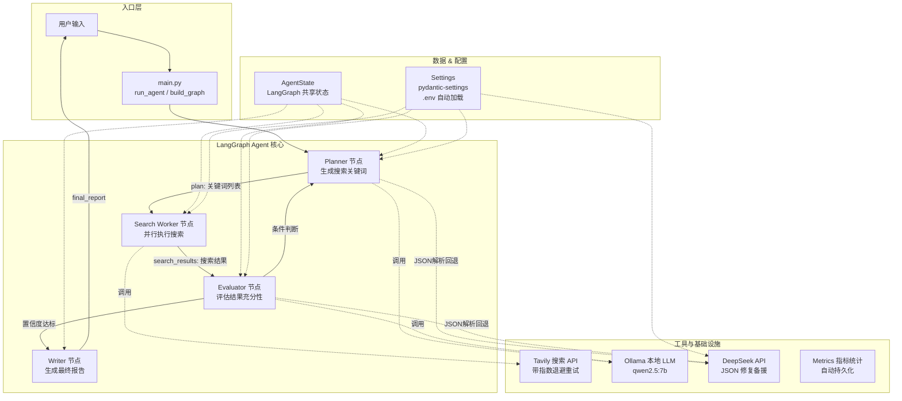
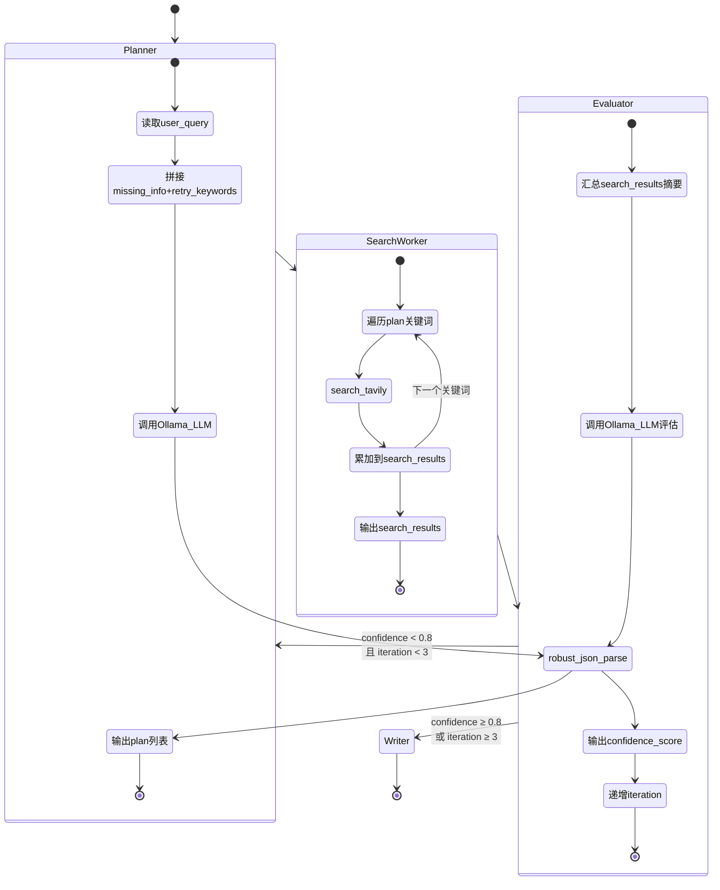
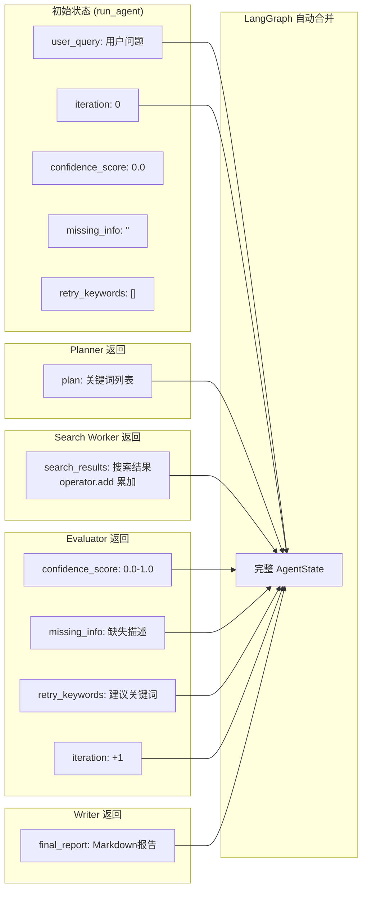
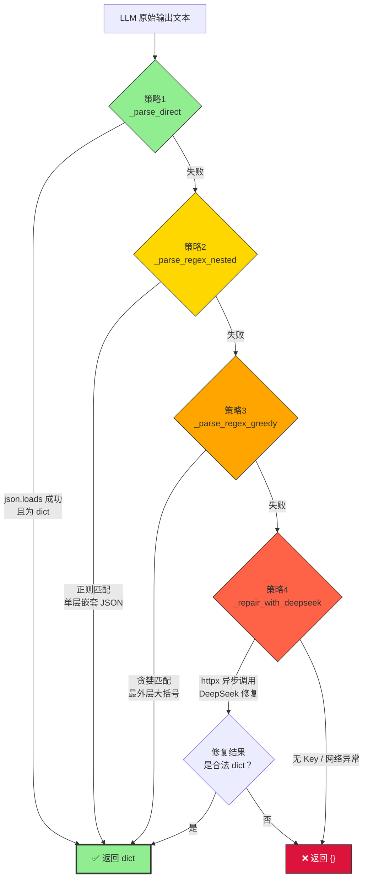
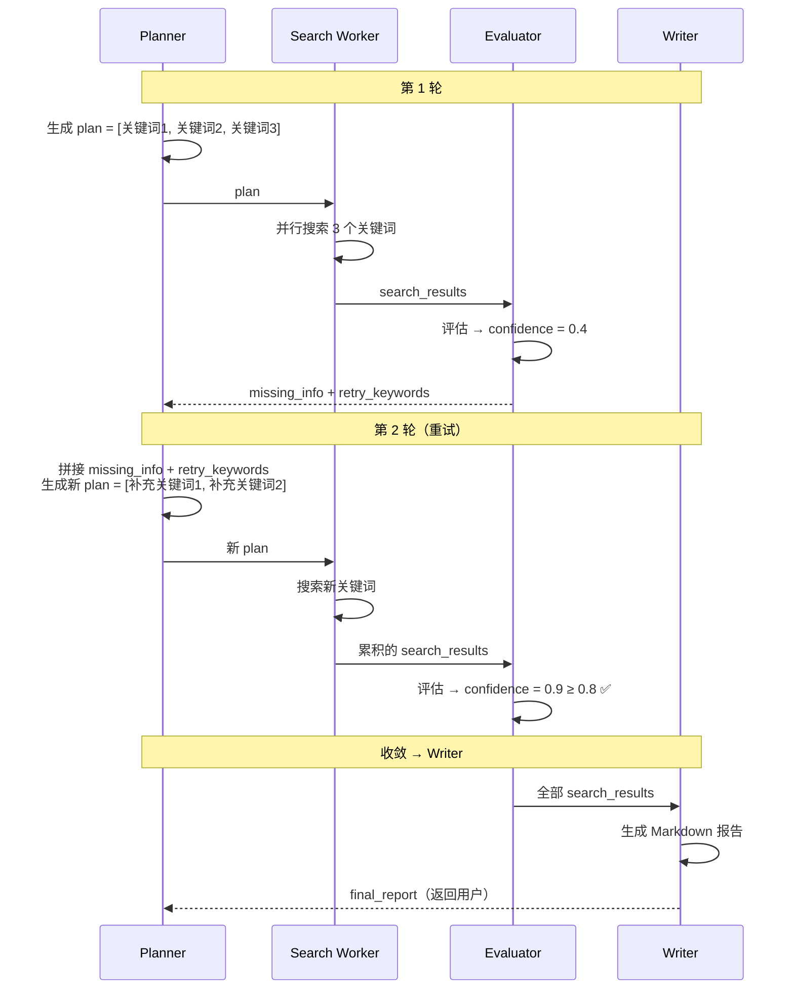
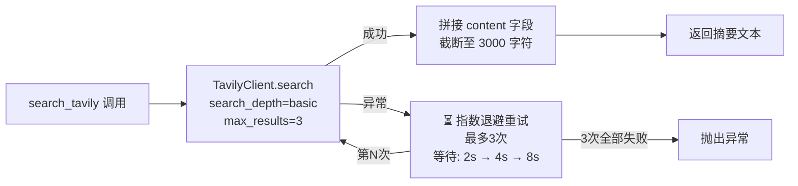
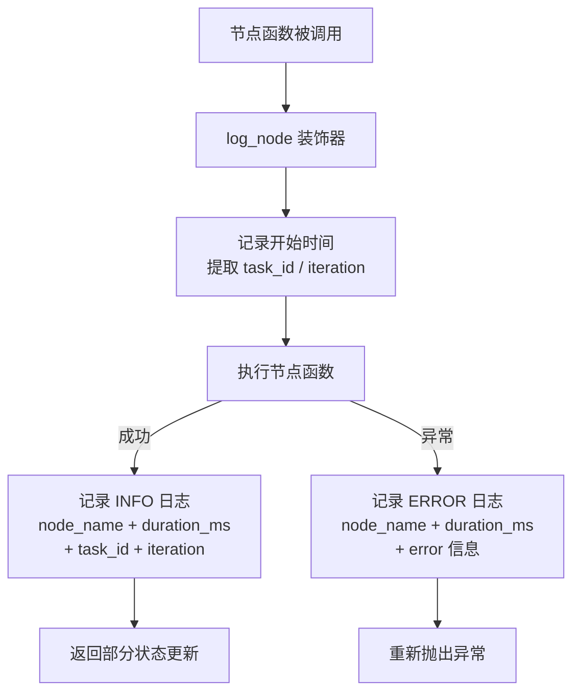
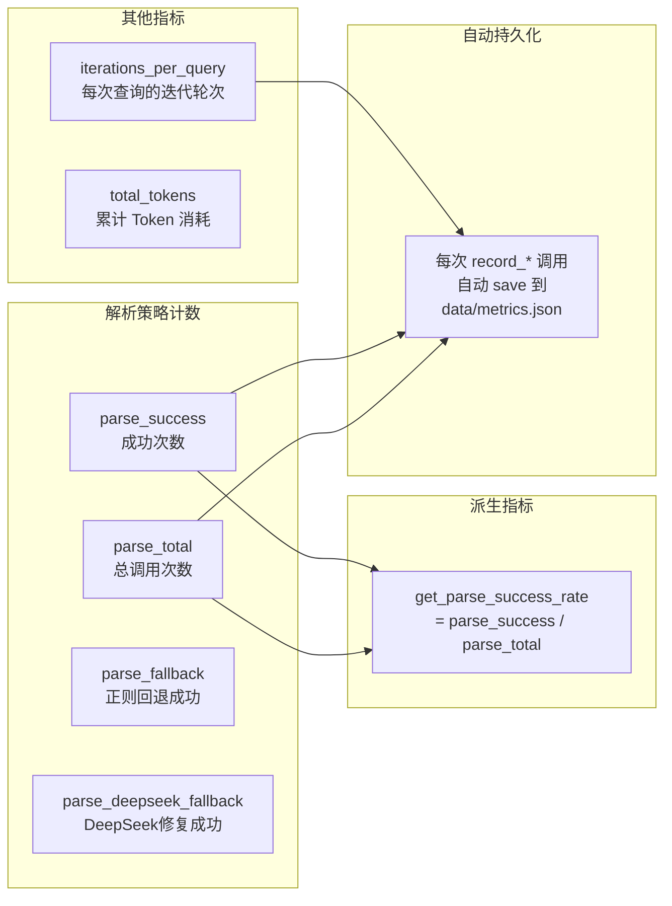
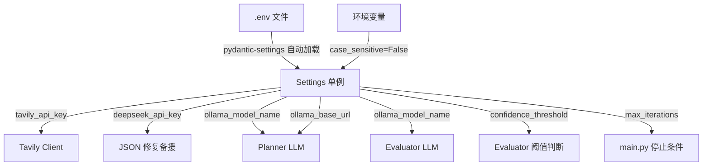

# AdaptiveSearchAgent 架构文档

> 生成时间：2025-01  
> 基于当前代码自动分析生成

---

## 1. 系统全景



---

## 2. LangGraph 工作流（状态机）



---

## 3. AgentState — 状态累积机制



**关键机制**：`search_results` 使用 `Annotated[List, operator.add]`，LangGraph 在多个并行搜索节点返回结果时自动拼接，而非覆盖。

---

## 4. JSON 解析 — 四层回退策略



| 策略 | 函数 | 方式 | 耗时 | 可靠性 |
|------|------|------|------|--------|
| 1 | `_parse_direct` | `json.loads()` 直接解析 | ~0ms | 低（LLM输出常含多余文本） |
| 2 | `_parse_regex_nested` | 正则提取 `{...}` 最多一层嵌套 | ~0ms | 中 |
| 3 | `_parse_regex_greedy` | 正则贪婪匹配 `{.*}` | ~0ms | 中高 |
| 4 | `_repair_with_deepseek` | DeepSeek LLM 修复（httpx 异步） | ~2000ms | 高 |

---

## 5. 重试循环机制



**停止条件**：
- `confidence_score >= settings.confidence_threshold (0.8)` → 进入 Writer
- `iteration >= settings.max_iterations (3)` → 强制进入 Writer（即使信心不足）

---

## 6. Tavily 搜索 — 指数退避重试



**重试配置**（`tenacity` 库）：
- 最大次数：3
- 退避策略：指数（`wait_exponential`），乘数1，最小2s，最大10s
- 触发条件：任意 `Exception`

---

## 7. 节点执行日志（可观测性）



---

## 8. Metrics 指标统计



---

## 9. 配置管理



---

## 10. 项目文件全景

```
AdaptiveSearchAgent/
├── main.py                         ← Agent 入口 / LangGraph 图编排
├── config.py                       ← pydantic-settings 配置
├── .env                            ← 环境变量（gitignore）
│
├── src/
│   ├── state.py                    ← AgentState TypedDict 定义
│   ├── agents/
│   │   ├── planner.py              ← 节点1：生成搜索关键词
│   │   ├── search_worker.py        ← 节点2：执行 Tavily 搜索
│   │   ├── evaluator.py            ← 节点3：评估结果充分性
│   │   └── writer.py               ← 节点4：生成 Markdown 报告
│   ├── tools/
│   │   └── search.py               ← Tavily 搜索封装 + 重试
│   └── utils/
│       ├── json_parser.py          ← 四层回退 JSON 解析
│       ├── logger.py               ← log_node 装饰器
│       └── metrics.py              ← 指标统计 + 持久化
│
├── tests/
│   ├── conftest.py                 ← create_test_state 工厂函数
│   ├── test_config.py              ← 配置挡板测试
│   ├── test_planner.py             ← Planner 集成测试
│   ├── test_search_worker.py       ← Search 集成测试
│   ├── test_evaluator.py           ← Evaluator 集成测试
│   ├── test_json_parser.py         ← JSON 解析单元测试
│   └── test_metrics.py             ← Metrics 单元测试
│
└── documents/
    └── architecture.md             ← 本文档
```
