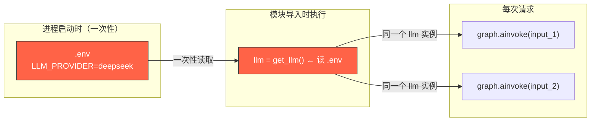
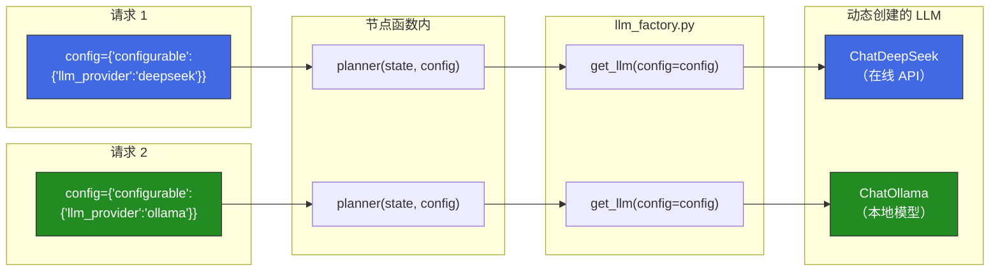
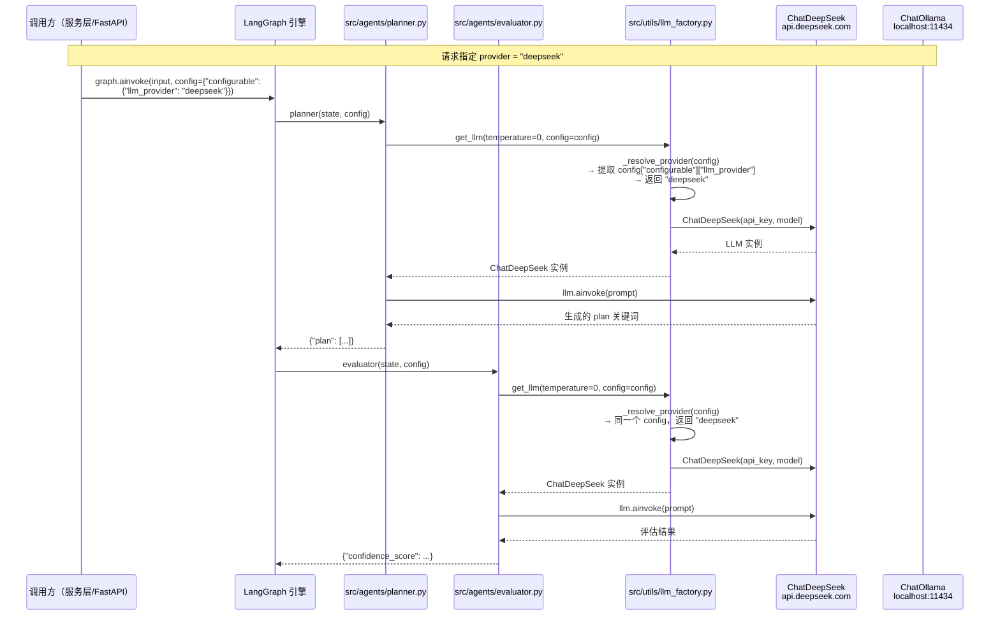
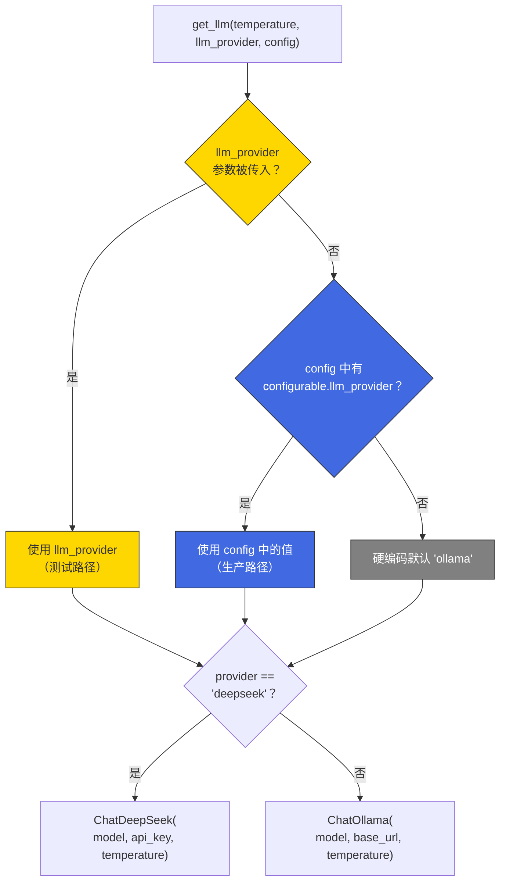
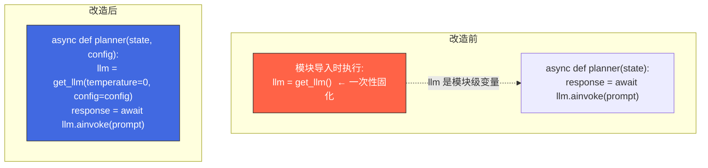
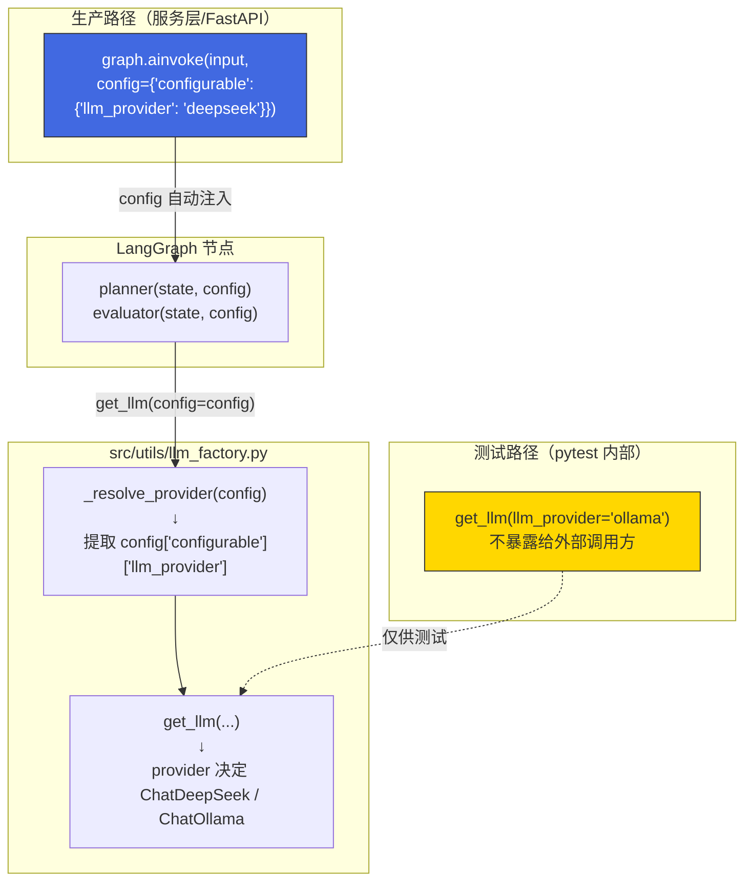

# LLM Provider 请求级动态切换设计文档

> 关联文件：`src/utils/llm_factory.py`、`src/agents/planner.py`、`src/agents/evaluator.py`

---

## 1. 一句话概括

**将 LLM 模型选择从"进程启动时全局固定"改为"每次请求动态指定"，调用方通过 `graph.ainvoke` 的 `config` 参数传入 provider，节点不再依赖 `.env` 全局状态。**

---

## 2. 改造前 vs 改造后对比

### 改造前（静态全局）

**问题**：所有请求共用同一个 LLM 实例，改模型需要重启进程。

### 改造后（请求级动态）

**效果**：请求 A 走 DeepSeek，请求 B 走 Ollama，互不干扰，无需重启。

---

## 3. 完整数据流（带文件名）

---

## 4. 改造的 3 个文件 —— 改动内容与设计意图

### 4.1 `src/utils/llm_factory.py`（核心）

#### 改动了什么

| 位置 | 改动前 | 改动后 |
|------|--------|--------|
| 新增 `_resolve_provider()` 函数 | 不存在 | 从 `config["configurable"]["llm_provider"]` 提取值，**绝不读取 `settings.llm_provider`** |
| `get_llm()` 签名 | `get_llm(temperature)` 只接受温度 | 新增 `llm_provider` 和 `config` 两个可选参数 |
| `get_llm()` provider 来源 | `settings.llm_provider`（读 .env） | `llm_provider 参数 → config → "ollama"` 三级回退 |
| 模块级 docstring | 描述 env 切换 | 明确标注"生产路径 / 测试路径" |

#### 为什么这样设计

1. **分离关注点**：生产路径（config）和测试路径（llm_provider 参数）泾渭分明，测试可以绕过 config 直接指定 provider
2. **不读 .env**：`.env` 是进程级全局状态，取消读取意味着 provider 的决策权完全交给调用方，服务层可以按用户、按 API Key、按租户任意策略选择模型
3. **"ollama" 硬编码回退**：当所有途径都未指定时，安全回退到本地模型，保证系统不会因缺失配置而崩溃

---

### 4.2 `src/agents/planner.py`（节点函数）

#### 改动了什么

| 位置 | 改动前 | 改动后 |
|------|--------|--------|
| 模块级变量 | `llm = get_llm(temperature=0)` 在导入时创建 | **已删除** |
| 函数签名 | `async def planner(state: AgentState) -> dict` | `async def planner(state: AgentState, config: RunnableConfig \| None = None) -> dict` |
| LLM 创建位置 | 模块顶层（导入时执行一次） | 函数体内部（每次调用时动态创建） |
| 新增 import | 无 | `from langchain_core.runnables import RunnableConfig` |

#### 为什么这样设计

1. **每次请求新建 LLM 实例**：`ChatOllama` / `ChatDeepSeek` 本质是纯参数封装（不含连接池），创建开销微秒级，换来 provider 的动态切换能力
2. **`config` 参数可选**：设为 `None` 默认值，测试代码 `await planner(state)` 仍然可以不加 config 直接调用（此时走硬编码 ollama 回退）
3. **LangGraph 自动注入**：当通过 `graph.ainvoke(input, config=...)` 调用时，LangGraph 引擎自动将 config 作为第二个位置参数传入节点函数，无需手动传递

---

### 4.3 `src/agents/evaluator.py`（节点函数）

与 `planner.py` 改动完全一致：删除模块级 `llm`，新增 `config` 参数，函数内动态创建。

额外注意：`@log_node("evaluator")` 装饰器内部使用 `*args, **kwargs` 透传参数，新增的 `config` 参数不受影响。

---

## 5. 调用方式全景

---

## 6. 设计原则总结

| 原则 | 体现 |
|------|------|
| **无状态节点** | 节点函数不从全局变量读取 provider，仅依赖入参 `config`，可安全水平扩展 |
| **决策权上移** | provider 选择由调用方（服务层）决定，而非下沉到基础设施代码 |
| **测试友好** | `llm_provider` 参数为测试保留直接注入通道，不影响生产路径 |
| **安全回退** | 所有路径都未指定时硬编码默认 `"ollama"`，不发生 `NoneType` 崩溃 |
| **最小改动** | 仅修改 1 个工厂 + 2 个节点函数，`search_worker.py` / `writer.py` 等零改动 |
