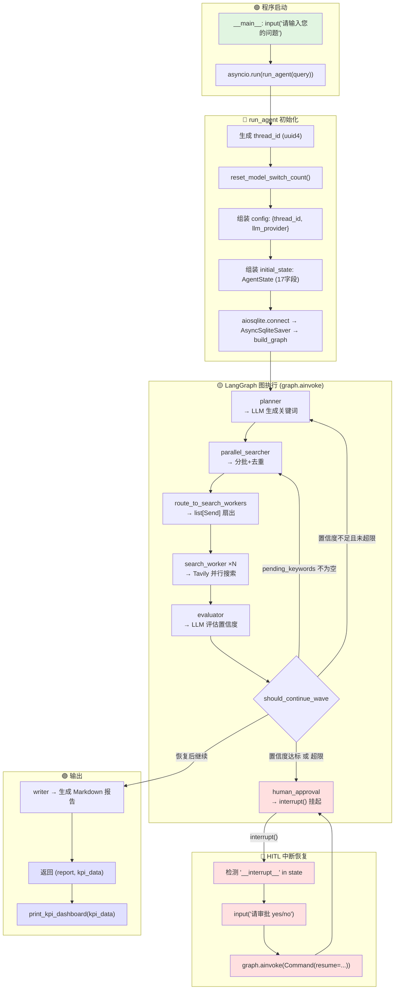

# 项目执行流程全解析

> **项目**：AdaptiveSearchAgent  
> **模式**：VibeCoding 增量开发  
> **技术栈**：Python 3.11 + LangGraph 1.1.10 + AsyncIO + aiosqlite + Ollama/DeepSeek + Tavily  
> **生成时间**：2025-05-18

---

## 1. 核心执行流（Mermaid 流程图）



---

## 2. 按文件的函数结构树状图

### 2.1 main.py — 入口与编排

```
main.py (296 行)
│
├── test_planner()                                      [async]  调试用
│   ├── 功能: 单独测试 planner 节点，不启动完整图
│   ├── 输入: 无（内部构造模拟 AgentState）
│   └── 输出: None（打印生成的 plan）
│
├── should_continue(state)                              [sync]   路由函数（已废弃）
│   ├── 功能: 串行图的 evaluator→writer/planner 路由
│   ├── 输入: AgentState
│   └── 输出: str ("writer" | "retry")
│
├── should_continue_wave(state)                         [sync]   路由函数 ★核心
│   ├── 功能: evaluator 后的三向路由（pending / planner / human_approval）
│   ├── 输入: AgentState
│   └── 输出: str ("parallel_searcher" | "planner" | "human_approval")
│   └── 逻辑:
│       ├── pending_keywords 不为空 → "parallel_searcher"   (继续下一波搜索)
│       ├── 置信度达标 或 超最大迭代 → "human_approval"     (进入审批)
│       └── 否则 → "planner"                                (重试搜索)
│
├── human_approval(state)                               [async]  节点函数 ★HITL
│   ├── 功能: 展示搜索摘要，调用 interrupt() 挂起等用户审批
│   ├── 输入: AgentState
│   ├── 输出: dict {"human_approved": bool}
│   └── 依赖: langgraph.types.interrupt
│
├── after_approval(state)                               [sync]   路由函数
│   ├── 功能: 审批后路由 → writer 或 END
│   ├── 输入: AgentState
│   └── 输出: str ("writer" | END)
│
├── build_graph(checkpointer=None)                      [sync]   图构建 ★核心
│   ├── 功能: 用 StateGraph(AgentState) 构建完整工作流图
│   ├── 输入: AsyncSqliteSaver | None
│   ├── 输出: CompiledStateGraph
│   └── 依赖:
│       ├── planner
│       ├── parallel_searcher
│       ├── search_worker
│       ├── evaluator
│       ├── writer
│       ├── human_approval
│       ├── route_to_search_workers   (条件边)
│       ├── should_continue_wave      (条件边)
│       └── after_approval            (条件边)
│
├── run_agent(user_query)                               [async]  执行入口 ★核心
│   ├── 功能: 完整执行一次搜索任务（初始化 → 图执行 → 中断恢复 → KPI 收集）
│   ├── 输入: str (用户查询)
│   ├── 输出: tuple[str, dict]  →  (final_report, kpi_data)
│   └── 依赖:
│       ├── uuid.uuid4()                        → 生成 thread_id
│       ├── reset_model_switch_count()           → 归零切换计数器
│       ├── aiosqlite.connect()                  → 异步 SQLite 连接
│       ├── AsyncSqliteSaver(conn)               → Checkpoint 持久化
│       ├── build_graph(checkpointer)            → 构建编译图
│       ├── graph.ainvoke(initial_state, config)  → 首次执行
│       ├── "__interrupt__" in final_state       → 检测中断
│       ├── Command(resume=user_input)            → 恢复执行
│       ├── get_model_switch_count()             → 读取切换次数
│       └── time.perf_counter()                  → 计算耗时
│
├── __main__                                            [sync]   命令行入口
│   ├── 功能: 获取用户输入 → 调用 run_agent → 打印报告 → 输出 KPI 仪表盘
│   ├── 输入: stdin
│   └── 输出: stdout (报告 + Rich 表格)
│
└── cli_graph = build_graph()                           [模块级] CLI 入口
    ├── 功能: 供 langgraph dev/up/build 命令导入
    └── 输出: CompiledStateGraph
```

### 2.2 src/state.py — 全局状态定义

```
src/state.py (69 行)
│
└── AgentState(TypedDict)                                状态结构体 ★核心
    ├── 功能: 定义 17 个字段的全局共享状态，LangGraph 所有节点读写
    ├── 合并规则: 普通字段覆盖更新，Annotated 字段用 operator.add 累加
    │
    ├── [原始输入] user_query: str                        只读，全程不变
    │
    ├── [计划控制] iteration: int                         每轮 evaluator 后 +1
    ├── [计划控制] plan: list[str]                        Planner 生成的关键词
    ├── [计划控制] retry_keywords: list[str]              Evaluator 建议补充的关键词
    │
    ├── [搜索结果] search_results: Annotated[list, add]  ★自动累加
    │
    ├── [评估] confidence_score: float                   Evaluator 输出的置信度
    ├── [评估] missing_info: str                         信息缺口描述
    │
    ├── [输出] final_report: str                         Writer 生成的 Markdown
    ├── [输出] human_approved: bool                      human_approval 节点设置
    │
    ├── [监控] task_id: str                              任务唯一标识
    ├── [监控] total_tokens: Annotated[int, add]         ★自动累加
    ├── [监控] input_tokens: Annotated[int, add]         ★自动累加
    ├── [监控] output_tokens: Annotated[int, add]        ★自动累加
    ├── [监控] current_llm: str                          当前模型 (ollama/deepseek)
    │
    ├── [批次] pending_keywords: list[str]               剩余待搜索关键词
    ├── [批次] _batch_keywords: list[str]                当前批次关键词（内部通道）
    │
    └── [会话] thread_id: str                            与 checkpointer 绑定
```

### 2.3 src/agents/planner.py — 搜索计划生成

```
planner.py (63 行)
│
└── planner(state, config=None)                           [async] 节点 ★核心
    ├── 功能: 调用 LLM 生成 3~5 个搜索关键词（首轮）或补充关键词（重试轮）
    ├── 输入: AgentState + RunnableConfig
    ├── 输出: dict {plan, total_tokens, input_tokens, output_tokens, current_llm}
    └── 子函数/依赖:
        ├── llm_call_with_fallback(prompt, config)       → (content, in, out, total)
        │   ├── 功能: 统一 LLM 调用（备援+Token计数+限流）
        │   ├── 输入: str, RunnableConfig
        │   └── 输出: tuple[str, int, int, int]
        └── robust_json_parse(content)                   → dict
            ├── 功能: 四层回退 JSON 解析
            ├── 输入: str (LLM 原始输出)
            └── 输出: dict ({"plan": [...]} 等)
```

### 2.4 src/agents/parallel_searcher.py — 并行搜索分发

```
parallel_searcher.py (94 行)
│
├── parallel_searcher(state)                              [async] 节点 ★核心
│   ├── 功能: 从 plan/pending/retry 取关键词 → 去重 → 分批 → 写入 _batch_keywords
│   ├── 输入: AgentState
│   ├── 输出: dict {_batch_keywords, pending_keywords}
│   └── 装饰器: @log_node("parallel_searcher")
│   └── 逻辑:
│       ├── 来源优先级: pending_keywords > retry_keywords > plan
│       ├── 去重: 与已有 search_results 比对，过滤已搜索的关键词
│       ├── 分批: 取前 max_concurrent_searches(默认2) 个为 batch
│       └── 剩余: 写入 pending_keywords 供下一波
│
└── route_to_search_workers(state)                        [sync] 路由函数 ★核心
    ├── 功能: 读取 _batch_keywords，生成 list[Send] 实现并行扇出
    ├── 输入: AgentState (parallel_searcher 已更新)
    ├── 输出: list[Send] | "evaluator"
    └── 依赖: langgraph.types.Send
    └── 逻辑:
        ├── _batch_keywords 为空 → 返回 "evaluator" (跳过搜索)
        └── 有关键词 → 返回 [Send("search_worker", {"keyword": kw}) for kw in batch]
```

### 2.5 src/agents/search_worker.py — 搜索执行

```
search_worker.py (23 行)
│
└── search_worker(state)                                  [async] 节点 ★核心
    ├── 功能: 执行单个关键词的 Tavily 搜索，返回结果
    ├── 输入: dict (AgentState + {"keyword": str})  ← Send.arg 合并而来
    ├── 输出: dict {"search_results": [{"keyword": kw, "content": text}]}
    ├── 装饰器: @log_node("search_worker")
    └── 依赖:
        └── search_tavily(keyword)                       → str
            ├── 功能: 调用 Tavily API 搜索，带 tenacity 指数退避重试
            ├── 输入: str (关键词)
            └── 输出: str (最多 3000 字符的搜索结果摘要)
```

### 2.6 src/agents/evaluator.py — 结果评估

```
evaluator.py (74 行)
│
└── evaluator(state, config=None)                         [async] 节点 ★核心
    ├── 功能: 调用 LLM 评估搜索结果是否足够回答用户问题
    ├── 输入: AgentState + RunnableConfig
    ├── 输出: dict {confidence_score, missing_info, retry_keywords,
    │               iteration, total_tokens, input_tokens, output_tokens, current_llm}
    ├── 装饰器: @log_node("evaluator")
    └── 子函数/依赖:
        ├── llm_call_with_fallback(prompt, config)       → (content, in, out, total)
        └── robust_json_parse(content)                   → dict
```

### 2.7 src/agents/writer.py — 报告生成

```
writer.py (32 行)
│
└── writer(state)                                         [async] 节点 ★核心
    ├── 功能: 汇总所有搜索结果，生成 Markdown 格式报告 + Token 成本统计
    ├── 输入: AgentState
    ├── 输出: dict {"final_report": str}
    └── 装饰器: @log_node("writer")
```

### 2.8 src/tools/search.py — 搜索工具

```
search.py (44 行)
│
├── client = TavilyClient(api_key)                        [模块级] 客户端单例
│
└── search_tavily(keyword)                                [async] 工具函数
    ├── 功能: 同步 Tavily 客户端通过 run_in_executor 异步化，带指数退避重试
    ├── 输入: str (搜索关键词)
    ├── 输出: str (搜索结果摘要，最多 3000 字符)
    └── 依赖:
        ├── @retry(stop=3, wait=exponential)              ← tenacity 重试装饰器
        └── asyncio.get_running_loop().run_in_executor()  ← 同步→异步适配
```

### 2.9 src/utils/llm_utils.py — LLM 备援引擎

```
src/utils/llm_utils.py (173 行)
│
├── _resolve_provider(config)                             [sync] 内部
│   ├── 功能: 从 config["configurable"]["llm_provider"] 读取当前模型名
│   ├── 输入: RunnableConfig | None
│   └── 输出: str ("ollama" | "deepseek")
│
├── _get_llm_instance(provider, temp)                     [sync] 内部
│   ├── 功能: 根据 provider 名创建 ChatOllama 或 ChatDeepSeek 实例
│   ├── 输入: str, float
│   └── 输出: ChatOllama | ChatDeepSeek
│
├── _extract_tokens(response)                             [sync] 内部
│   ├── 功能: 从 AIMessage.usage_metadata 提取 (input, output, total) token
│   ├── 输入: AIMessage
│   └── 输出: tuple[int, int, int]
│
├── _model_switch_count: int                              [全局变量] ★KPI
│   ├── 功能: 记录当前会话的模型切换次数
│   └── 修改点: llm_call_with_fallback 备援切换时 +1
│
├── reset_model_switch_count()                            [sync] 公开
│   ├── 功能: 归零模型切换计数器（每会话开始时调用）
│   └── 输出: None
│
├── get_model_switch_count()                              [sync] 公开
│   ├── 功能: 读取当前会话的模型切换次数
│   └── 输出: int
│
├── _get_semaphore()                                      [sync] 内部
│   ├── 功能: 获取全局 LLM 调用信号量单例（控制并发数）
│   └── 输出: asyncio.Semaphore
│
├── _invoke_with_semaphore(llm, prompt)                   [async] 内部
│   ├── 功能: 在信号量保护下调用 LLM，返回 AIMessage
│   ├── 输入: BaseChatModel, str
│   └── 输出: AIMessage
│
└── llm_call_with_fallback(prompt, config)                [async] 公开 ★核心
    ├── 功能: 统一 LLM 调用入口 → 主模型重试 → 失败自动切 deepseek
    ├── 输入: str, RunnableConfig | None
    ├── 输出: tuple[str, int, int, int]  →  (content, in_tok, out_tok, total_tok)
    └── 阶段1: 当前 provider → 最多重试 llm_max_retries 次（指数退避 + jitter）
    └── 阶段2: 切换 → config["configurable"]["llm_provider"] = "deepseek"
              → 后续节点自动生效 → _model_switch_count += 1
```

### 2.10 src/utils/json_parser.py — JSON 鲁棒解析

```
json_parser.py (173 行)
│
├── _parse_direct(text)                                   [sync] 策略1
│   ├── 功能: 直接 json.loads 解析
│   ├── 输入: str
│   └── 输出: dict | None
│
├── _parse_regex_nested(text)                             [sync] 策略2
│   ├── 功能: 嵌套感知正则提取最外层 JSON
│   ├── 输入: str
│   └── 输出: dict | None
│
├── _parse_regex_greedy(text)                             [sync] 策略3
│   ├── 功能: 贪婪正则匹配 {.*}
│   ├── 输入: str
│   └── 输出: dict | None
│
├── _repair_with_deepseek(malformed_text)                [async] 策略4
│   ├── 功能: 调用 DeepSeek API 修复损坏的 JSON（httpx 异步请求）
│   ├── 输入: str
│   └── 输出: str | None
│
└── robust_json_parse(text)                              [async] 公开 ★核心
    ├── 功能: 四层回退 JSON 解析，每层失败自动降级
    ├── 输入: str (LLM 原始输出文本)
    ├── 输出: dict (解析成功) 或 {} (全部失败)
    └── 依赖: await metrics.record_parse()  ← 异步持久化解析统计
```

### 2.11 src/utils/metrics.py — 指标统计（异步安全版）

```
metrics.py (118 行)
│
├── class Metrics
│   ├── __init__(data_path)                               [sync]
│   │   └── 依赖: _load_sync()  ← 模块导入时执行一次
│   │
│   ├── _load_sync()                                      [sync] 内部
│   │   ├── 功能: 从 JSON 文件加载历史统计数据
│   │   └── 调用时机: 仅 Metrics() 实例化时
│   │
│   ├── _save_sync()                                      [sync] 内部
│   │   ├── 功能: 同步写磁盘（mkdir + json.dump）
│   │   └── 调用者: asyncio.to_thread()
│   │
│   ├── save()                                            [async] 公开
│   │   ├── 功能: 通过 asyncio.to_thread 异步写入磁盘
│   │   └── 依赖: asyncio.to_thread(_save_sync)
│   │
│   ├── record_parse(success, fallback, deepseek)         [async] 公开
│   │   ├── 功能: 记录一次 JSON 解析结果 + 异步持久化
│   │   └── 输入: bool, bool, bool
│   │
│   ├── record_iterations(iterations)                     [async] 公开
│   │   ├── 功能: 记录迭代深度 + 异步持久化
│   │   └── 输入: int
│   │
│   ├── record_parallel_speedup(speedup)                  [async] 公开
│   │   ├── 功能: 记录并行加速比 + 异步持久化
│   │   └── 输入: float
│   │
│   └── get_parse_success_rate()                          [sync] 公开
│       ├── 功能: 计算 JSON 解析成功率（纯计算，无 I/O）
│       └── 输出: float (0.0 ~ 1.0)
│
└── metrics = Metrics()                                    [模块级单例] ★全局共享
```

### 2.12 src/utils/logger.py — JSON 日志

```
logger.py (125 行)
│
├── get_logger()                                          [sync] 内部
│   ├── 功能: 获取全局单例 JSON 格式日志器
│   └── 输出: logging.Logger
│
└── log_node(node_name)                                   [sync] 装饰器工厂 ★核心
    ├── 功能: 高阶装饰器，自动记录节点执行耗时/成功/失败
    ├── 输入: str (节点名)
    ├── 输出: Callable → 包装后的 async 函数
    └── 使用: @log_node("parallel_searcher") 修饰节点函数
    └── 日志字段: node_name, duration_ms, task_id, iteration, error
```

### 2.13 src/utils/cli_report.py — Rich KPI 仪表盘

```
cli_report.py (200 行)
│
├── _estimate_cost(in_tok, out_tok)                       [sync] 内部
│   ├── 功能: DeepSeek 费率估算 (输入 ¥0.001/1K, 输出 ¥0.002/1K)
│   ├── 输入: int, int
│   └── 输出: float (保留4位小数)
│
├── _status_text(value, color)                            [sync] 内部
│   └── 功能: 创建带颜色的 Rich Text 对象
│
├── _add_identity_rows(table, ...)                        [sync] 内部
│   └── 功能: 填充 会话ID / 模型 / 切换次数 行
│
├── _add_token_rows(table, ...)                           [sync] 内部
│   └── 功能: 填充 输入/输出/总 Token / 费用 行
│
├── _add_result_rows(table, ...)                          [sync] 内部
│   └── 功能: 填充 置信度 / 审批 / 耗时 行
│
└── print_kpi_dashboard(cost_info)                        [sync] 公开
    ├── 功能: 渲染 Rich 终端表格（10 项 KPI，绿/黄/红 三色标注）
    ├── 输入: dict {thread_id, current_llm, model_switches, input_tokens,
    │               output_tokens, total_tokens, confidence_score,
    │               human_approved, elapsed_seconds}
    └── 输出: None（stdout）
```

### 2.14 src/utils/math_safe_calc.py — AST 安全计算器

```
math_safe_calc.py (268 行)
│
├── 异常体系
│   ├── MathSafeCalcError(Exception)                      基类
│   ├── SecurityError(MathSafeCalcError)                  安全违规
│   └── MathEvalError(MathSafeCalcError)                  数学错误
│
├── _ALLOWED_NODE_TYPES: frozenset                        9 种 AST 节点白名单
├── _ALLOWED_FUNCTIONS: dict                              7 个安全函数 (sin/cos/...)
├── _BINOP_MAP: dict                                      5 种运算符映射
├── _UNARYOP_MAP: dict                                    1 种一元运算
│
├── _validate_constant(node)                              [sync] 校验常量
├── _validate_call(node)                                  [sync] 校验函数调用
├── _validate_ast(node)                                   [sync] 递归白名单校验 ★防线
├── _eval_node(node)                                      [sync] 递归求值 ★防线
│
└── safe_math_calculate(expression)                       [sync] 公开入口
    ├── 功能: 安全计算数学表达式（AST 白名单，零依赖，禁止 eval）
    ├── 输入: str (如 "2 + 3 * sin(0.5)")
    └── 输出: float
```

### 2.15 config.py — 全局配置

```
config.py (65 行)
│
├── LLMProvider(StrEnum)                                  OLLAMA / DEEPSEEK
│
└── Settings(BaseSettings)                                 pydantic-settings 自动加载 .env
    ├── tavily_api_key: str                               Tavily API 密钥
    ├── deepseek_api_key: str                             DeepSeek API 密钥
    ├── DEEPSEEK_MODEL_NAME: str                          模型名
    ├── ollama_model_name: str                            模型名
    ├── ollama_base_url: str                              Ollama 地址
    ├── confidence_threshold: float = 0.8                 置信度阈值
    ├── max_iterations: int = 3                           最大重试轮次
    ├── max_concurrent_searches: int = 2                  并行搜索数
    ├── max_concurrent_llm_calls: int = 2                 LLM 并发数
    ├── llm_max_retries: int = 2                          主模型重试次数
    ├── llm_fallback_enabled: bool = True                 备援开关
    └── model_config = {"env_file": ".env"}               自动读取 .env

settings = Settings()                                     全局单例
```

---

## 3. 完整数据流说明

### 3.1 阶段 1：用户输入 → 状态初始化

```
用户输入: "LangGraph 和 LangChain 的区别"
  │
  ▼
__main__: query = input("请输入您的问题：")
  │
  ▼
asyncio.run(run_agent(query))
  │
  ▼
run_agent():
  thread_id = str(uuid.uuid4())           # "a1b2c3d4-..."
  reset_model_switch_count()              # _model_switch_count = 0
  config = {
    "configurable": {
      "thread_id": thread_id,             # 会话隔离 key
      "llm_provider": "ollama"            # 初始主模型
    }
  }
  initial_state = {
    "user_query": "LangGraph 和...",      # 用户问题
    "iteration": 0,                       # 初始迭代
    "plan": [], "search_results": [],     # 空初始值
    "confidence_score": 0.0,
    "total_tokens": 0, "input_tokens": 0, "output_tokens": 0,
    "current_llm": "ollama",
    "pending_keywords": [], "_batch_keywords": [],
    "human_approved": False,              # 等待审批
    "thread_id": thread_id,
    "final_report": "", "missing_info": "",
    "retry_keywords": [], "task_id": "..."
  }
```

### 3.2 阶段 2：图构建

```
aiosqlite.connect("data/checkpoints.db")  → conn
conn.is_alive = lambda: True              → 兼容性修补
AsyncSqliteSaver(conn)                    → checkpointer
build_graph(checkpointer=checkpointer)
  │
  ├── StateGraph(AgentState)              → builder
  ├── add_node("planner", planner)
  ├── add_node("parallel_searcher", parallel_searcher)
  ├── add_node("search_worker", search_worker)
  ├── add_node("evaluator", evaluator)
  ├── add_node("writer", writer)
  ├── add_node("human_approval", human_approval)
  ├── set_entry_point("planner")
  ├── add_edge("planner", "parallel_searcher")
  ├── add_conditional_edges("parallel_searcher", route_to_search_workers, ...)
  ├── add_edge("search_worker", "evaluator")
  ├── add_conditional_edges("evaluator", should_continue_wave, ...)
  ├── add_conditional_edges("human_approval", after_approval, ...)
  └── builder.compile(checkpointer=checkpointer)  → CompiledStateGraph
```

### 3.3 阶段 3：图执行（第一轮 Wave）

```
graph.ainvoke(initial_state, config)
  │
  ├─[1] planner(state, config)
  │     输入: user_query="LangGraph 和...", missing_info=""
  │     内部: llm_call_with_fallback(prompt, config)
  │           → Ollama ainvoke → AIMessage
  │           → _extract_tokens → (in=120, out=45, total=165)
  │     外部: robust_json_parse(content)
  │           → {"plan": ["LangGraph vs LangChain", "LangGraph 与...", "LangGraph 和..."]}
  │     输出: {"plan": [k1,k2,k3], "total_tokens": 165,
  │            "input_tokens": 120, "output_tokens": 45, "current_llm": "ollama"}
  │     state 变化: plan=[k1,k2,k3], total_tokens=165, input_tokens=120, ...
  │
  ├─[2] parallel_searcher(state)
  │     输入: plan=[k1,k2,k3], pending_keywords=[]
  │     逻辑: source="plan" → 去重 → 取前2个为 batch，k3 为 remaining
  │     输出: {"_batch_keywords": [k1,k2], "pending_keywords": [k3]}
  │     state 变化: _batch_keywords=[k1,k2], pending_keywords=[k3]
  │
  ├─[3] route_to_search_workers(state)          ← 条件边路由
  │     输入: _batch_keywords=[k1,k2]
  │     输出: [Send("search_worker", {"keyword": k1}),
  │            Send("search_worker", {"keyword": k2})]
  │     ★ LangGraph 在这之后并行启动 2 个 search_worker
  │
  ├─[4a] search_worker(state={... "keyword": k1})   ┐
  │     输入: keyword=k1                             │
  │     内部: search_tavily(k1) → Tavily API         ├─ 并行执行
  │     输出: {"search_results": [{"keyword":k1,     │  (Semaphore
  │              "content": "AI agent frameworks..."}]}│   限流)
  │                                                   │
  ├─[4b] search_worker(state={... "keyword": k2})   ┘
  │     输出: {"search_results": [{"keyword":k2, "content": "..."}]}
  │     ★ LangGraph 对 search_results 使用 operator.add 自动合并
  │     state 变化: search_results=[{k1:...}, {k2:...}]
  │
  ├─[5] evaluator(state, config)
  │     输入: search_results=[{k1:...}, {k2:...}], iteration=0
  │     内部: llm_call_with_fallback(prompt, config) → LLM 评估
  │     输出: {"confidence_score": 0.85, "missing_info": "",
  │            "retry_keywords": [], "iteration": 1,
  │            "total_tokens": 200, "input_tokens": 150, ...}
  │     state 变化: confidence=0.85, iteration=1, total_tokens=165+200=365
  │
  ├─[6] should_continue_wave(state)              ← 条件边路由
  │     输入: pending_keywords=[k3], confidence=0.85, iteration=1
  │     判断: pending_keywords 不为空 → 返回 "parallel_searcher"
  │     ★ 进入第二波搜索（处理 pending 关键词）
```

### 3.4 阶段 4：第二波 Wave（pending 关键词）

```
  ├─[7] parallel_searcher(state)                     ← 再次进入
  │     输入: pending_keywords=[k3]
  │     逻辑: source="pending" → 去重 → batch=[k3], remaining=[]
  │     输出: {"_batch_keywords": [k3], "pending_keywords": []}
  │
  ├─[8] route_to_search_workers → [Send("search_worker", {"keyword": k3})]
  │
  ├─[9] search_worker → Tavily 搜索 k3
  │     state 变化: search_results=[{k1}, {k2}, {k3}]  (累加了第3个)
  │
  ├─[10] evaluator(state, config)
  │      输出: {"confidence_score": 0.92, "iteration": 2,
  │             "total_tokens": 180, ...}
  │      state 变化: confidence=0.92, iteration=2, total_tokens=365+180=545
  │
  ├─[11] should_continue_wave(state)
  │      输入: pending_keywords=[], confidence=0.92, iteration=2
  │      判断: pending 为空 + confidence >= 0.8 → 返回 "human_approval"
  │      ★ 满足条件，进入人工审批
```

### 3.5 阶段 5：Human-in-the-Loop（中断恢复）

```
  ├─[12] human_approval(state)                       ← 审批节点
  │      输入: search_results 有 3 个结果, confidence=0.92
  │      ★ 调用 interrupt():
  │        - LangGraph 保存当前完整 state 到 SQLite (checkpointer)
  │        - 图执行暂停, graph.ainvoke 返回
  │        - 返回的 state 包含 "__interrupt__" 键
  │
  ▼ ainvoke 返回 ──────────────────────────────────────
  
  run_agent() 中:
  if "__interrupt__" in final_state:               ← 检测中断
      user_input = input(">>> 请审批 (yes/no): ")  ← 等待用户
      # 用户输入 "yes"
      final_state = await graph.ainvoke(
          Command(resume="yes"), config            ← 恢复执行
      )
  
  ────────────────────────────────────── 恢复后继续 ─▶
  
  ★ LangGraph 从 SQLite 读取保存的 state
  ★ human_approval 中的 interrupt("yes") 返回 "yes"
  ★ approved = True
  ★ 返回 {"human_approved": True}
  
  ├─[13] after_approval(state)                        ← 条件边路由
  │      输入: human_approved=True
  │      输出: "writer"  (批准 → 生成报告)
  │
  ├─[14] writer(state)
  │      输入: search_results=[{k1},{k2},{k3}], total_tokens=545
  │      输出: {"final_report": "# 调研报告：...\n\n## 1. ..."}
  │      state 变化: final_report 被填充
  │
  └─[15] END  ← 图执行结束
```

### 3.6 阶段 6：输出

```
  run_agent 返回 (final_report, kpi_data)
  │
  __main__:
  report, kpi_data = asyncio.run(run_agent(query))
  │
  print(report)                          # Markdown 报告
  │
  print_kpi_dashboard(kpi_data)          # Rich CLI 表格
      ├── 会话 ID: a1b2c3...
      ├── 模型: ollama | 切换: 0 次
      ├── 输入: 420 | 输出: 125 | 总计: 545
      ├── 费用: ¥0.0007
      ├── 置信度: 92.00%
      ├── 审批: 是 | 耗时: 12.34s
      └── ※ 费率说明
```

### 3.7 Checkpoint 持久化时间线

```
时刻 T0: graph.ainvoke(initial_state, config)
         └→ planner 开始执行前，initial_state 被写入 SQLite (checkpoint #1)

时刻 T1: planner 返回 → state 更新 → 写入 checkpoint #2

时刻 T2: parallel_searcher 返回 → checkpoint #3

时刻 Tn: 每完成一个节点 → 自动写入新 checkpoint

时刻 T_interrupt: human_approval 调用 interrupt()
         └→ ★ 强制最终快照写入 SQLite
         └→ state 含 "__interrupt__" 标记返回给调用方

时刻 T_resume: graph.ainvoke(Command(resume="yes"), config)
         └→ ★ 从 SQLite 读取 T_interrupt 的 state
         └→ human_approval 收到 "yes" → 继续执行
         └→ 后续节点继续写 checkpoint
```

---

## 4. 关键技术点说明

### 4.1 async/await 异步结构

```
asyncio.run(run_agent(query))          ← 顶层：创建事件循环
  └─ async def run_agent():
       ├─ await graph.ainvoke(...)     ← LangGraph 内部异步调度节点
       │    └─ async def planner():
       │         └─ await llm_call_with_fallback()   ← LLM 异步调用
       │              └─ await llm.ainvoke(prompt)   ← HTTP/WebSocket 异步
       │    └─ async def search_worker():
       │         └─ await search_tavily()
       │              └─ await loop.run_in_executor() ← 同步→异步适配
       ├─ await metrics.save()
       │    └─ await asyncio.to_thread(self._save_sync)  ← I/O→线程池
       └─ (同步函数不受影响：should_continue_wave, after_approval 等)

★ 关键：所有 I/O 操作（LLM 调用、搜索 API、文件写入）均为异步，
   确保事件循环不被阻塞，适配 langgraph dev 服务器。
```

### 4.2 LangGraph 中断恢复（interrupt / Command）

```
┌─────────────────────────────────────────────────────────┐
│ interrupt(prompt)                                      │
│                                                        │
│ 1. Prompt 内容存入 checkpoint                          │
│ 2. 当前完整 state 写入 SQLite                          │
│ 3. graph.ainvoke 返回（state 含 "__interrupt__" 键）   │
│ 4. 调用方检测到中断，等待用户输入                      │
└─────────────────────────────────────────────────────────┘
                        │
                        ▼
┌─────────────────────────────────────────────────────────┐
│ Command(resume=user_input)                             │
│                                                        │
│ 1. 携带用户输入传给 graph.ainvoke                      │
│ 2. LangGraph 从 SQLite 恢复 state                      │
│ 3. interrupt() 返回 user_input                         │
│ 4. 节点继续执行                                        │
└─────────────────────────────────────────────────────────┘

★ 注意：LangGraph 1.1.x + checkpointer 模式下，
   interrupt() 不抛出 GraphInterrupt 异常！
   而是通过 state["__interrupt__"] 标记来检测。
```

### 4.3 AsyncSqliteSaver Checkpoint 持久化

```python
# 连接创建
conn = await aiosqlite.connect("data/checkpoints.db")
conn.is_alive = lambda: True           # aiosqlite 0.22.x 兼容修补
checkpointer = AsyncSqliteSaver(conn)

# 图编译
graph = build_graph(checkpointer=checkpointer)

# 执行时 config 中的 thread_id 作为 session key
config = {"configurable": {"thread_id": "uuid-xxxx"}}
graph.ainvoke(state, config)
```

**Checkpoint 作用**：
- **中断恢复**：interrupt() 后状态不丢失，可用另一个 ainvoke 恢复
- **会话隔离**：不同 thread_id 的 checkpoint 互不影响
- **持久化**：程序重启后仍可通过 thread_id 恢复

### 4.4 thread_id 会话隔离

```
thread_id = str(uuid.uuid4())           # 每次 run_agent 生成唯一 ID
config = {
  "configurable": {
    "thread_id": thread_id,             # ← checkpoint 的 key
    "llm_provider": "ollama"
  }
}
```

- 同一个 thread_id 的多次 ainvoke 共享同一个 checkpoint 链
- 不同 thread_id 的 checkpoint 完全隔离
- thread_id 也存储在 AgentState 中，传给 writer 用于日志

### 4.5 条件路由逻辑

```
图中有 3 个条件路由点：

1. parallel_searcher → route_to_search_workers
   ├── 有 _batch_keywords → list[Send] 扇出到 search_worker (并行)
   └── 无 → "evaluator" (直接跳过搜索)

2. evaluator → should_continue_wave
   ├── pending_keywords 不为空 → "parallel_searcher" (处理剩余关键词)
   ├── 置信度达标 或 超最大迭代 → "human_approval"
   └── 否则 → "planner" (重试搜索)

3. human_approval → after_approval
   ├── human_approved=True  → "writer" (生成报告)
   └── human_approved=False → END (直接结束)
```

### 4.6 Send 并行扇出机制

```python
# parallel_searcher 节点 → 返回 dict（更新 _batch_keywords）
# route_to_search_workers 路由函数 → 返回 list[Send]

[Send("search_worker", {"keyword": "k1"}),
 Send("search_worker", {"keyword": "k2"})]

# LangGraph:
# - 并行启动 2 个 search_worker 实例
# - Send.arg 与全局 state 合并后传入节点
# - 所有 search_worker 完成后，通过 search_worker→evaluator 固定边汇聚
# - search_results 使用 Annotated[list, operator.add] 自动合并
```

### 4.7 双模型备援链路

```
llm_call_with_fallback(prompt, config)
  │
  ├── 阶段1: 从 config 读 "llm_provider" → 当前是 "ollama"
  │         尝试 Ollama → 失败 → 重试(最多2次, 指数退避+jitter)
  │         成功 → 返回 (content, in_tok, out_tok, total_tok)
  │
  └── 阶段2: 全部失败 → config["configurable"]["llm_provider"] = "deepseek"
              _model_switch_count += 1
              调用 DeepSeek → 返回
              ★ 后续节点读 config 自动使用 deepseek
```

---

> **文档版本**: v1.0  
> **最后更新**: 2025-05-18  
> **适用范围**: AdaptiveSearchAgent 全项目
