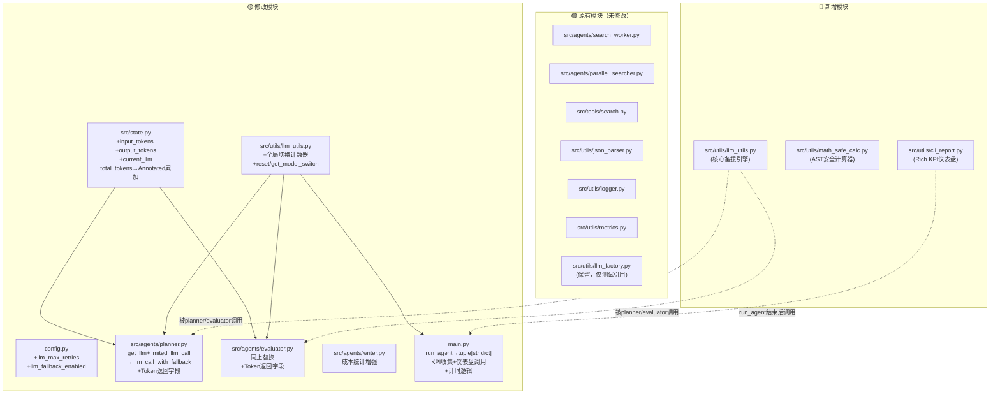

# VibeCoding 迭代复盘：三大功能破解文档

> **生成时间**：2025-05-16  
> **项目**：AdaptiveSearchAgent  
> **背景**：三个独立功能通过 AI VibeCoding 方式实现，本文对其进行黑盒破解分析，梳理实现原理、文件改动、模块联动关系。

---

## 目录

1. [系统全局视图](#1-系统全局视图)
2. [功能一：双模型备援 + Token 计数](#2-功能一双模型备援--token-计数)
3. [功能二：AST 白名单安全计算器](#3-功能二ast-白名单安全计算器)
4. [功能三：Rich CLI KPI 指标报告](#4-功能三rich-cli-kpi-指标报告)
5. [交叉影响分析](#5-交叉影响分析)
6. [测试指南](#6-测试指南)

---

## 1. 系统全局视图

### 1.1 文件改动总览



### 1.2 功能覆盖矩阵

| 模块 \ 功能 | 双模型备援+Token | AST安全计算器 | Rich KPI仪表盘 |
|-------------|:---:|:---:|:---:|
| `config.py` | 🟡 修改 | 🟢 未动 | 🟢 未动 |
| `src/state.py` | 🟡 修改 | 🟢 未动 | 🟢 未动 |
| `src/agents/planner.py` | 🟡 修改 | 🟢 未动 | 🟢 未动 |
| `src/agents/evaluator.py` | 🟡 修改 | 🟢 未动 | 🟢 未动 |
| `src/agents/writer.py` | 🟡 修改 | 🟢 未动 | 🟢 未动 |
| `src/utils/llm_utils.py` | 🔵 新增+🟡追加 | 🟢 未动 | 🟡 追加计数器 |
| `src/utils/math_safe_calc.py` | 🟢 未动 | 🔵 新增 | 🟢 未动 |
| `src/utils/cli_report.py` | 🟢 未动 | 🟢 未动 | 🔵 新增 |
| `main.py` | 🟡 修改 | 🟢 未动 | 🟡 修改 |

---

## 2. 功能一：双模型备援 + Token 计数

### 2.1 核心原理

```
                   ┌──────────────┐
                   │ 节点调用 LLM  │
                   │ (planner /   │
                   │  evaluator)  │
                   └──────┬───────┘
                          │
                          ▼
              ┌───────────────────────┐
              │ llm_call_with_fallback│  ← 🔵 统一入口（llm_utils.py）
              │ (prompt, config)      │
              └───────────┬───────────┘
                          │
            ┌─────────────┴─────────────┐
            ▼                           ▼
   ┌─────────────────┐        ┌─────────────────┐
   │  阶段1: 主模型   │        │  阶段2: 备援切换  │
   │  (ollama)       │        │  (deepseek)     │
   │                 │        │                 │
   │  尝试调用        │        │  修改config中的  │
   │  ├─成功→返回     │  重试  │  llm_provider   │
   │  └─失败→重试     │  耗尽  │  为deepseek     │
   │     (最多2次)    │──────▶│  ↓              │
   │    等待1s/2s递增 │        │  调用deepseek   │
   └─────────────────┘        │  ↓              │
                              │  返回结果       │
                              └─────────────────┘
```

**关键设计**：
- `config["configurable"]["llm_provider"]` 被原地修改为 `"deepseek"` 后，后续所有节点（planner、evaluator）都自动使用新模型——因为 LangGraph 在整个 `ainvoke` 生命周期内复用同一个 config dict。
- `_model_switch_count` 是模块级全局变量，每次 fallback 切换时 +1，供 KPI 报告读取。

### 2.2 Token 计数流

```
planner() 调用 llm_call_with_fallback()
  └→ 返回 (content, input_tokens, output_tokens)
  └→ return {"plan": [...], "total_tokens": in+out,
              "input_tokens": in, "output_tokens": out,
              "current_llm": "ollama"|"deepseek"}

evaluator() 同上

LangGraph 自动累加（Annotated + operator.add）：
  └→ final_state["total_tokens"]  = planner.total + evaluator.total + ...
  └→ final_state["input_tokens"]  = planner.input + evaluator.input + ...
  └→ final_state["output_tokens"] = planner.output + evaluator.output + ...
```

**状态字段改动**（`src/state.py`）：

| 字段 | 原类型 | 新类型 | 说明 |
|------|--------|--------|------|
| `total_tokens` | `int` | `Annotated[int, operator.add]` | 改为累加模式 |
| `input_tokens` | — 不存在 — | `Annotated[int, operator.add]` | 🔵 新增累加字段 |
| `output_tokens` | — 不存在 — | `Annotated[int, operator.add]` | 🔵 新增累加字段 |
| `current_llm` | — 不存在 — | `str` | 🔵 当前使用的模型名 |

> **LangGraph 知识**：`Annotated[int, operator.add]` 是 LangGraph 的**扇入聚合（Reducer）机制**。多个并行节点（如 Send 扇出的 search_worker）或者多次顺序调用同一个节点时，返回的 dict 中相同 key 的值不会互相覆盖，而是用 `operator.add` 自动累加。这使得 Token 无需手动求和。

### 2.3 配置项

| 配置项 | 位置 | 默认值 | 说明 |
|--------|------|--------|------|
| `llm_max_retries` | `config.py:54` | `2` | 主模型重试次数 |
| `llm_fallback_enabled` | `config.py:55` | `True` | 是否启用备援 |

### 2.4 与旧代码的联动

| 旧代码 | 变化 | 影响 |
|--------|------|------|
| `planner.py` 导入 `llm_factory` | → 改为导入 `llm_utils` | `llm_factory` 不再被生产代码引用（测试仍用） |
| `evaluator.py` 导入 `llm_factory` | → 同上 | 同上 |
| `planner.py` 返回 `{"plan": plan}` | → 追加 4 个 Token 字段 | LangGraph 自动合并，下游无感 |
| `evaluator.py` 返回 `{..., "iteration": ...}` | → 追加 4 个 Token 字段 | 同上 |

### 2.5 副作用

- ✅ **无副作用**：`llm_factory.py` 保留不动，测试文件仍正常引用
- ⚠️ `run_agent` 返回值从 `str` 变为 `tuple[str, dict]`，如有外部调用方需适配

---

## 3. 功能二：AST 白名单安全计算器

### 3.1 核心原理

```
用户表达式字符串
        │
        ▼
┌──────────────────────────┐
│ 第1层：ast.parse()       │  Python 内置，不执行代码
│ mode="eval"              │  仅生成语法树
└──────────┬───────────────┘
           │
           ▼
┌──────────────────────────┐
│ 第2层：_validate_ast()   │  递归遍历 AST
│                          │
│  每个节点检查：           │
│  ├─ 类型在白名单？        │  ──否→ SecurityError
│  ├─ Constant 只允许数字？  │  ──否→ SecurityError
│  ├─ Call 函数名在白名单？  │  ──否→ SecurityError
│  ├─ Call 无关键字参数？   │  ──有→ SecurityError
│  ├─ Name 独立出现？       │  ──是→ SecurityError(变量引用)
│  └─ BinOp/UnaryOp 运算符？ │  ──不在映射表→ SecurityError
└──────────┬───────────────┘
           │ 校验通过
           ▼
┌──────────────────────────┐
│ 第3层：_eval_node()      │  递归求值
│                          │
│  Constant → float(value) │
│  BinOp    → op(left,right)│  除零→ MathEvalError
│  UnaryOp  → -operand     │
│  Call     → func(*args)  │  sqrt(-1)→MathEvalError
└──────────┬───────────────┘
           │
           ▼
      返回 float
```

### 3.2 白名单明细

**AST 节点白名单（9种）**：
`Expression` `Constant` `BinOp` `UnaryOp` `Call` `Name` `Load` `Add/Sub/Mult/Div/Pow/USub`

**安全函数白名单（7个）**：
`sin` `cos` `tan` `sqrt` `log` `exp` `abs`

**安全运算符（5种二元 + 1种一元）**：
`+` `-` `*` `/` `**` `-x`

### 3.3 攻击向量拦截测试（12/12 通过）

| 攻击向量 | 表达式 | 拦截层 | 结果 |
|----------|--------|--------|:--:|
| 双下划线导入 | `__import__("os")` | 第2层：函数名不在白名单 | ✅ |
| 文件操作 | `open("/etc/passwd")` | 第2层：函数名不在白名单 | ✅ |
| exec | `exec("print(1)")` | 第2层：函数名不在白名单 | ✅ |
| globals | `globals()` | 第2层：函数名不在白名单 | ✅ |
| getattr | `getattr(math,"sin")` | 第2层：函数名不在白名单 | ✅ |
| 分号注入 | `1+1; import os` | 第1层：语法错误 | ✅ |
| 列表推导 | `[i for i in range(10)]` | 第2层：节点类型不在白名单 | ✅ |
| lambda | `lambda x: x` | 第2层：节点类型不在白名单 | ✅ |
| 集合字面量 | `{1,2,3}` | 第2层：节点类型不在白名单 | ✅ |
| 布尔运算 | `True and False` | 第2层：节点类型不在白名单 | ✅ |
| 三元表达式 | `1 if True else 0` | 第2层：节点类型不在白名单 | ✅ |
| 字符串 | `"hello"` | 第2层：Constant 非数字 | ✅ |

### 3.4 异常体系

```python
MathSafeCalcError              # 基类
  ├── SecurityError            # 安全违规（白名单外）
  └── MathEvalError            # 数学错误（除零/负数开方等）
```

### 3.5 如何被 LangGraph 节点调用

`safe_math_calculate` 是**同步函数**，可在任何 LangGraph 节点中直接调用：

```python
from src.utils.math_safe_calc import safe_math_calculate, SecurityError, MathEvalError

async def some_node(state: AgentState) -> dict:
    try:
        result = safe_math_calculate(state["some_expression"])
        return {"computed_value": result}
    except SecurityError:
        # 表达式包含代码注入企图
        ...
    except MathEvalError:
        # 数学错误（如除零）
        ...
```

### 3.6 副作用

- ✅ **零副作用**：独立文件，不导入任何项目模块，不修改任何现有文件
- ✅ 同步函数，不阻塞事件循环

---

## 4. 功能三：Rich CLI KPI 指标报告

### 4.1 核心原理

```
 run_agent() 执行流程
 ══════════════════════════════════════════════════
 
 ① reset_model_switch_count()    ← 归零切换计数器
 ② start_time = perf_counter()   ← 开始计时
 ③ graph.ainvoke() → final_state ← 图执行（含中断恢复）
 ④ elapsed = perf_counter()-start← 计算耗时
 ⑤ 组装 kpi_data dict（9个字段）← 从 final_state + 全局计数器提取
 ⑥ return (report, kpi_data)
 
 __main__ 中
 ══════════════════════════════════════════════════
 
 ⑦ report, kpi_data = asyncio.run(run_agent(query))
 ⑧ print_kpi_dashboard(kpi_data) ← 调用 Rich 表格渲染
```

### 4.2 KPI 数据流

```
final_state                    llm_utils 模块全局
─────────────                  ────────────────
total_tokens    ─┐             _model_switch_count ─→ model_switches
input_tokens    ─┤
output_tokens   ─┤
current_llm     ─┼─→ kpi_data dict ─→ print_kpi_dashboard()
confidence_score─┤                   ─→ Rich Table 渲染
human_approved  ─┤
thread_id       ─┤
                ─┘             elapsed_seconds (计时)
```

### 4.3 Rich 表格结构

`print_kpi_dashboard` 内部按指标类别拆分为 3 个子函数（降低圈复杂度）：

| 子函数 | 填充的行 | 圈复杂度 |
|--------|----------|:--:|
| `_add_identity_rows()` | 会话ID、最终模型、切换次数 | ≤4 |
| `_add_token_rows()` | 输入Token、输出Token、总Token、预估费用 | ≤5 |
| `_add_result_rows()` | 置信度、人工审批、执行耗时 | ≤6 |

**颜色编码规则**：

| 指标 | 🟢 绿色 | 🟡 黄色 | 🔴 红色 |
|------|---------|---------|---------|
| 总 Token | < 5,000 | < 20,000 | ≥ 20,000 |
| 预估费用 | < ¥0.01 | < ¥0.05 | ≥ ¥0.05 |
| 置信度 | ≥ 0.8 | ≥ 0.5 | < 0.5 |
| 切换次数 | 0 | 1 | ≥ 2 |
| 执行耗时 | < 30s | < 60s | ≥ 60s |

### 4.4 费用计算公式

```python
def _estimate_cost(input_tokens, output_tokens):
    cost = (input_tokens / 1000) * 0.001   # 输入：¥0.001/1K tokens
         + (output_tokens / 1000) * 0.002  # 输出：¥0.002/1K tokens
    return round(cost, 4)  # 保留4位小数
```

### 4.5 副作用

- ⚠️ `run_agent` 返回值类型从 `str` 变为 `tuple[str, dict]`
- ⚠️ `llm_utils._model_switch_count` 是模块级全局变量，多线程场景需注意（当前项目单线程 asyncio，无影响）
- ✅ 不影响 LangGraph 图结构、Checkpoint、interrupt 流程

---

## 5. 交叉影响分析

### 5.1 三个功能的耦合关系

```
功能一（备援+Token） ←────────── 功能三（KPI报告）
       │                              │
       │ 提供:                         │ 读取:
       │  - input_tokens              │  - input_tokens
       │  - output_tokens             │  - output_tokens
       │  - total_tokens              │  - total_tokens
       │  - current_llm               │  - current_llm
       │  - _model_switch_count       │  - model_switches
       │                              │
       └──────────────────────────────┘

功能二（安全计算器） — 完全独立，零耦合
```

### 5.2 数据流汇总

```
                    ┌─────────────────┐
                    │   config.py     │
                    │ +llm_max_retries│
                    │ +llm_fallback   │
                    └────────┬────────┘
                             │ 全局配置
                             ▼
┌──────────────┐    ┌─────────────────┐    ┌──────────────────┐
│  planner.py  │───▶│  llm_utils.py   │◀───│  evaluator.py    │
│              │    │                 │    │                  │
│ 调用:        │    │ llm_call_with   │    │ 调用:            │
│ llm_call_    │    │ _fallback()     │    │ llm_call_        │
│ with_fallback│    │                 │    │ with_fallback    │
│              │    │ _model_switch   │    │                  │
│ 返回:        │    │ _count (全局)   │    │ 返回:            │
│ +Token字段   │    └────────┬────────┘    │ +Token字段       │
└──────┬───────┘             │             └──────┬───────────┘
       │                     │                    │
       └──────────┬──────────┴────────────────────┘
                  │ 写入 state (operator.add 累加)
                  ▼
         ┌─────────────────┐
         │  AgentState     │
         │  total_tokens   │──────────────┐
         │  input_tokens   │              │
         │  output_tokens  │              │
         │  current_llm    │              │
         └─────────────────┘              │
                  │                       │
                  ▼                       ▼
         ┌─────────────────┐    ┌──────────────────┐
         │   writer.py     │    │  cli_report.py   │
         │ 报告内嵌Token统计│    │ Rich表格KPI仪表盘 │
         └─────────────────┘    └──────────────────┘
```

### 5.3 功能二（安全计算器）的独立性

```
math_safe_calc.py  ← 零项目依赖
  ├─ import ast        (标准库)
  ├─ import math       (标准库)
  ├─ import operator   (标准库)
  └─ 不导入任何 src/ config/ 模块

可被任何 LangGraph 节点直接 import 调用
不修改任何现有文件，不依赖任何项目状态
```

---

## 6. 测试指南

### 6.1 功能一：双模型备援测试

```bash
# 正常场景：ollama 在线
cd /home/ubhuazhu/dev_pros/AdaptiveSearchAgent
eval $(poetry env activate)
printf "测试查询\nyes\n" | python main.py
# 预期：KPI表格显示「模型：ollama」「切换次数：0」

# 备援场景：停止 ollama 服务后运行
# systemctl stop ollama  # 或其他方式
printf "测试查询\nyes\n" | python main.py
# 预期：KPI表格显示「模型：deepseek」「切换次数：≥1」
```

### 6.2 功能二：安全计算器测试

```bash
eval $(poetry env activate)
python -c "
from src.utils.math_safe_calc import safe_math_calculate, SecurityError, MathEvalError

# 正常计算
assert safe_math_calculate('2 + 3 * sin(0.5)') > 0
print('✅ 正常计算')

# 安全拦截
try:
    safe_math_calculate('__import__(\"os\").system(\"ls\")')
except SecurityError:
    print('✅ 拦截代码注入')

# 数学错误
try:
    safe_math_calculate('1/0')
except MathEvalError:
    print('✅ 拦截除零')
"
```

### 6.3 功能三：KPI 仪表盘测试

```bash
# 完整流程测试（自动包含仪表盘输出）
eval $(poetry env activate)
printf "测试查询\nyes\n" | python main.py

# 预期输出末尾包含 Rich 表格：
# ╭──────────────────────────────────────╮
# │   智能体执行报告 & KPI 指标           │
# ╰──────────────────────────────────────╯
#          KPI 指标详情
# ┏━━━━━━━━━━━━┳━━━━━━━━━━┳━━━━━━━━━━┓
# ┃ 指标       ┃ 数值     ┃ 状态     ┃
# ...
```

### 6.4 副作用检查清单

| 检查项 | 方法 | 预期 |
|--------|------|------|
| old `llm_factory.py` 仍可用 | `python -c "from src.utils.llm_factory import get_llm"` | ✅ 无报错 |
| `run_agent` 返回值解包 | `report, kpi = asyncio.run(run_agent("test"))` | ✅ 双值解包 |
| math_safe_calc 无项目依赖 | `grep -r "from src\|from config" src/utils/math_safe_calc.py` | 无输出 |
| Checkpoint 不受影响 | 检查 `data/checkpoints.db` 正常生成 | ✅ |
| Human-in-the-loop 不受影响 | 审批输入 `yes`/`no` 后流程正常 | ✅ |
